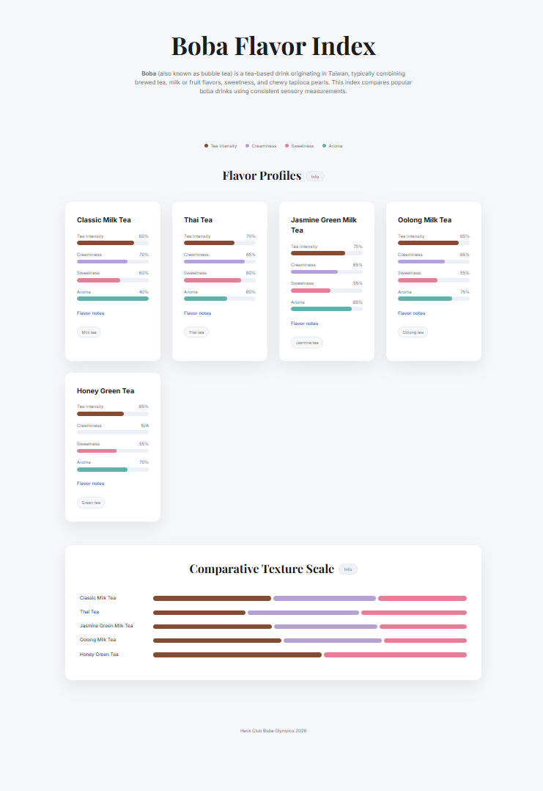

# Boba Flavor Index

## overview
the **boba flavor index** is an interactive website showcasing popular boba (bubble tea) drinks. It compares drinks using consistent sensory metrics, including **tea intensity**, **creaminess**, **sweetness**, and **aroma**. 

## included teas

- classic milk tea
- thai tea
- jasmine green milk tea
- oolong milk tea
- honey green tea

## preview

created for **Hack Club [Boba Olympics](https://olympics.hackclub.com/) 2026**